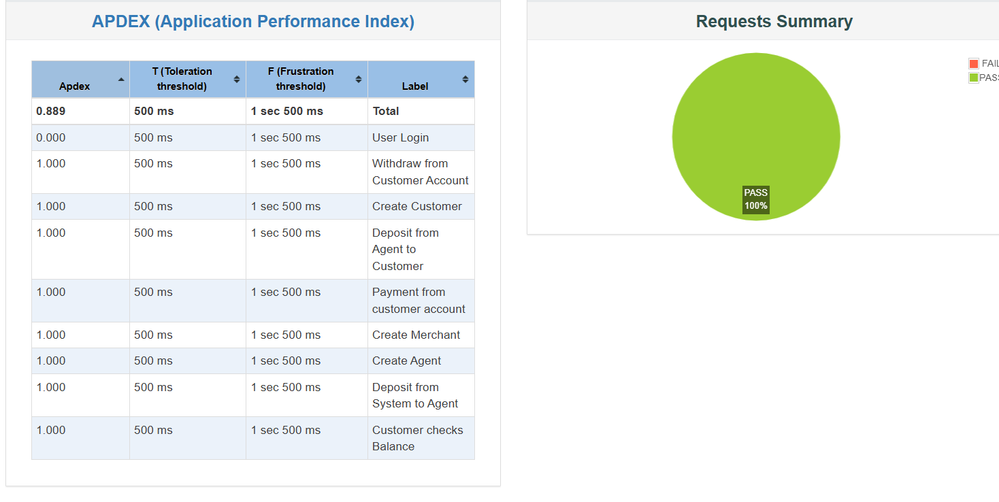

# Demo Transaction API JMeter Test Plan

## Overview
This repository contains a JMeter test plan (`demo-transaction-api.jmx`) to perform a series of transactions and operations on a financial API. The test plan includes:
1. Admin creating an agent and a customer.
2. Depositing 2000 tk to the agent from the system account.
3. Depositing 1000 tk to the customer from the agent's account.
4. Checking the balance of the customer account.
5. Withdrawing 500 tk from the customer account.
6. Making a payment of 200 tk from the customer account to a merchant.

## Prerequisites
- Apache JMeter installed.
- Java JDK installed.
- Clone this repository.

## Testing Report Picture

  
